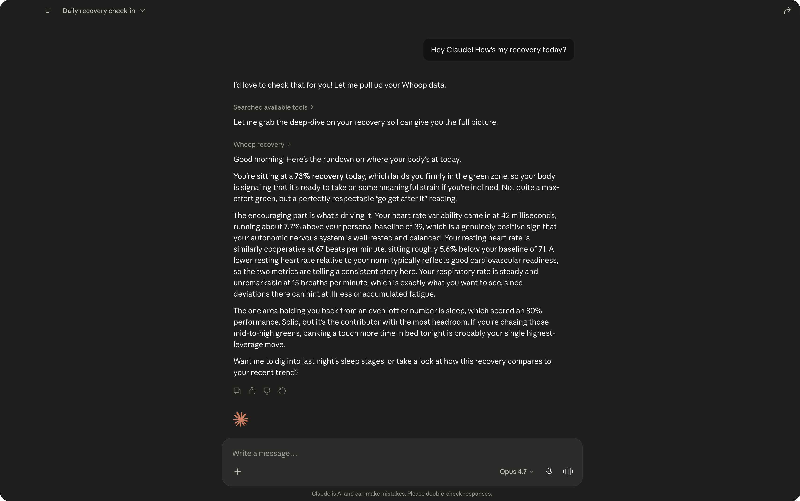

<p align="center">
  
</p>

<p align="center">
  <i>Give Claude (or any MCP-compatible AI) <b>full read + write access to your Whoop fitness data</b> by wrapping Whoop's private iOS API — not their limited 13-endpoint public developer API.</i>
</p>

<p align="center">
  <a href="#quickstart-5-minutes"></a>
  <a href="#table-of-contents"></a>
  <a href="WHOOP_API_ENDPOINTS.md"></a>
  <a href="LICENSE"></a>
</p>

<p align="center">
  <a href="#remote-hosting"></a>
  <a href="#claude-desktop-config"></a>
  
  
  
  
</p>

<p align="center">
  
  
  
  
  
  
</p>

<p align="center">
  
</p>

47 tools, structured zod-validated outputs, bundled catalogs (372 exercises, 308 behaviors, 203 sports), write-safety harness, automatic Cognito token refresh, session-scoped catalog gate. TypeScript 6, Node 24, 127 tests.

> *Note: this works through Whoop's private iOS API rather than the public OAuth API. That isn't what Whoop's terms allow — see the [FAQ](#faq) if you want the full picture before installing.*

---

## Quickstart (5 minutes)

```bash
# 1. Clone + install
git clone https://github.com/briangaoo/whoop-mcp.git
cd whoop-mcp
npm install

# 2. Add your Whoop login to .env
cp .env.example .env
# edit .env: set WHOOP_EMAIL and WHOOP_PASSWORD

# 3. One-time auth (handles SMS MFA if your account has it)
npm run cognito-bootstrap

# 4. Build
npm run build
```

Then wire into your client:

**Claude Desktop** — edit `~/Library/Application Support/Claude/claude_desktop_config.json`:

```json
{
  "mcpServers": {
    "whoop": {
      "command": "/opt/homebrew/bin/node",
      "args": ["/absolute/path/to/whoop-mcp/dist/server.js"]
    }
  }
}
```

**Claude Code** — one line:

```bash
claude mcp add whoop /opt/homebrew/bin/node /absolute/path/to/whoop-mcp/dist/server.js
```

Restart your client. Ask Claude: *"how am i doing today on whoop?"* — you should see structured recovery / sleep / strain data come back.

**Optional but recommended:** install the `whoop-mcp` CLI globally so you can manage the server, run tests, deploy, and tail logs from any directory:

```bash
npm link   # from inside whoop-mcp/ — symlinks `whoop-mcp` into your global PATH

whoop-mcp         # banner + help
whoop-mcp info    # current state of your install
whoop-mcp ping    # is my deployment alive?
```

See [The `whoop-mcp` CLI](#the-whoop-mcp-cli) for the full command reference.

Want to host it on a remote URL so you can use it from multiple devices? See [Remote hosting](#remote-hosting). Stuck? Jump to [Troubleshooting](#troubleshooting).

---

## Table of contents

1. [Quickstart (5 minutes)](#quickstart-5-minutes) ← above
2. [Why this exists](#why-this-exists)
3. [What it does](#what-it-does)
4. [Architecture](#architecture)
5. [The 47 tools](#the-47-tools)
6. [Authentication](#authentication)
7. [Write-safety harness](#write-safety-harness)
8. [Bundled catalogs](#bundled-catalogs)
9. [Configuration](#configuration)
10. [Remote hosting](#remote-hosting)
11. [The `whoop-mcp` CLI](#the-whoop-mcp-cli)
12. [Privacy + security](#privacy--security)
13. [Troubleshooting](#troubleshooting)
14. [Comparison to alternatives](#comparison-to-alternatives)
15. [FAQ](#faq)
16. [Disclaimers](#disclaimers)
17. [Acknowledgments](#acknowledgments)

**Other root-level docs:** [`WHOOP_API_ENDPOINTS.md`](WHOOP_API_ENDPOINTS.md) (full API reference) · [`CHANGELOG.md`](CHANGELOG.md) · [`CONTRIBUTING.md`](CONTRIBUTING.md) · [`SECURITY.md`](SECURITY.md) · [`LICENSE`](LICENSE)

---

## Why this exists

Whoop ships two APIs:

- The **public developer API** at [`developer.whoop.com`](https://developer.whoop.com/api/) is OAuth2, read-only, and exposes **13 endpoints** under 6 scopes. You get recovery score, sleep stage totals, workout strain, body measurements (3 fields), and HRV/RHR per cycle. No journal, no Strength Trainer, no Whoop Coach, no hypnogram, no stress monitor, no trends, no writes, nothing else. Numeric `sport_id` was removed 2025-09-01.
- The **private iOS API** is what the actual Whoop app uses — `api.prod.whoop.com` behind AWS Cognito. **384 distinct operations across 47 microservices**, including everything missing from above.

This MCP wraps the iOS surface.

### What the iOS API has that the public OAuth doesn't

| Capability | Tool |
|---|---|
| HRV / RHR / respiratory / VO2 / weight time-series (25 metrics × up to 4 windows) | `whoop_trend` |
| Hypnogram (per-minute sleep stage timeline) | `whoop_sleep` |
| Strength Trainer — every set, every workout, full 372-exercise catalog, PRs | `whoop_lift_*` (8 tools) |
| 308-behavior Journal + behavior impact analysis | `whoop_journal*` (5 tools) |
| Stress monitor (15-min buckets) | `whoop_stress, whoop_live_stress` |
| Whoop Coach AI chat | `whoop_coach_ask` |
| Smart Alarm (read + 4 write modes) | `whoop_smart_alarm*` |
| HR zones (read + configure max HR / 5 custom zones) | `whoop_hr_zones*` |
| Compare-windows, sleep coach, calendar grid, performance assessment | `whoop_compare`, `whoop_sleep_need`, `whoop_calendar`, `whoop_performance_assessment` |
| Live HR / activity state / live stress | `whoop_live_*` (3 tools) |
| Community leaderboards, hidden metrics, women's health (cycle / symptoms / MCI) | `whoop_leaderboard`, `whoop_hidden_metric`, `whoop_cycle*` |
| **14 write tools** — log workouts, journal entries, profile edits, smart-alarm config | various |

If recovery + sleep totals + workout list is enough for you, use the public OAuth API. If anything in the table is interesting, you need this. The iOS API was discovered via mitmproxy — full methodology in [`WHOOP_API_ENDPOINTS.md`](WHOOP_API_ENDPOINTS.md).

---

## What it does

The MCP runs as a local Node process. It speaks **Model Context Protocol** over stdio (or HTTP for remote deployments), registers 47 tools at startup, and waits for tool calls from a connected MCP client.

When a tool is called:

1. Authenticates via the cached Cognito access token (auto-refreshes if expired)
2. Issues HTTP requests to `api.prod.whoop.com`
3. Walks the response to extract a flat domain object (the **projection** step)
4. Validates the projected object against a zod schema (catches Whoop API drift)
5. Returns the structured JSON to the MCP client

Writes follow the same path plus a **preview gate**: every write tool defaults `confirm: false`, returning a preview of what would be sent. Claude must explicitly re-call with `confirm: true` to fire.

See [The 47 tools](#the-47-tools) for the full per-tool reference.

---

## Architecture

```
Claude Desktop / Code  ──stdio──▶  src/server.ts  ──▶  47 tool handlers
                                                          │
                                       ┌──────────────────┼──────────────────┐
                                       ▼                  ▼                  ▼
                                  schemas (zod)    projections (raw→flat)  whoop/client
                                                                              │
                                                                              ▼ HTTPS
                                                                       api.prod.whoop.com
```

### Three layers per tool

Every tool is a schema + projection + handler:

- **`src/schemas/<tool>.ts`** — zod schema. The contract Claude sees. Used at runtime to validate the projection's output before returning.
- **`src/projections/<tool>.ts`** — pure function turning Whoop's raw BFF response into a flat object. All the "Whoop puts this data over there, not where you'd expect" knowledge lives here. Tested against captured fixtures.
- **`src/tools/v2/<tool>.ts`** — ~25-100 lines. Registers the tool, parses input args, calls the client, runs the projection, validates with zod, returns.

Almost no logic in the tool file. That's all in the projection — which makes the codebase highly testable (projections are pure transformations, tested against `tests/fixtures/*.json` without hitting the network).

### Shape drift handling

When Whoop changes a response shape, the projection emits unexpected data, zod's `.parse()` fails, and the MCP throws `WhoopProjectionError` instead of silently returning malformed data to Claude. Fix: use `whoop_raw` + `whoop_endpoints` to capture the new shape, update the projection, update the fixture, ship.

> **Recent example:** in May 2026, Whoop migrated recovery + strain deep-dives from `GRAPHING_CARD` tiles (keyed by `content.title` like `"RECOVERY"`) to `SCORE_GAUGE` + `CONTRIBUTORS_TILE` items with stable `content.id` keys (`RECOVERY_SCORE_GAUGE`, `CONTRIBUTORS_TILE_HRV`). Other deep-dives still use the old card-based shape. The escape-hatch tools made the migration trivial to debug.


---

## The 47 tools

Below is every tool with its signature, source endpoints, and notes. Inputs are the zod schema; outputs are described as TypeScript-ish for brevity (full schemas in `src/schemas/`).

### Snapshots & profile (4)

#### `whoop_today`
Composite snapshot of today: recovery score + state, sleep performance + stages, day strain so far, current activity state, workouts count.

- **Input:** `{}`
- **Source endpoints (3 parallel):** `GET /home-service/v1/home?date=today`, `GET /home-service/v1/deep-dive/sleep/last-night?date=today`, `GET /activities-service/v1/user-state`
- **Output:** `{date, recovery: {score, state, hrv_ms, rhr_bpm}, sleep: {performance_pct, total_sleep_ms, time_in_bed_ms, efficiency_pct, stages: {rem_ms, light_ms, sws_ms, wake_ms}, started_at, ended_at}, strain: {score, calories, avg_hr_bpm, max_hr_bpm, workouts_count}, current_state: {state, sport_name, started_at}}`

#### `whoop_day`
Same composite as `whoop_today` but for any past date. Drops the live state (not relevant for historical days).

- **Input:** `{date: string}` (required, YYYY-MM-DD)
- **Source:** Same as `whoop_today` minus the user-state fetch
- **Output:** Same as `whoop_today`, with `current_state.*` set to null

#### `whoop_profile`
Identity + body measurements + privacy state.

- **Input:** `{}`
- **Source endpoints (4 parallel):** `/users-service/v2/bootstrap`, `/users-service/v1/hidden-metrics/BODY_COMP`, `/users-service/v1/hidden-metrics/HEALTHSPAN`, `/users-service/v1/stealth-mode`
- **Output:** `{user_id, account_id, email, username, first_name, last_name, birthday, gender, height: {m, cm, ft}, weight: {kg, lb}, city, country, timezone_offset, bio_data: {max_hr_bpm, resting_hr_bpm, min_hr_bpm}, fitness_level, membership: {status, in_effect}, privacy: {stealth_mode, body_comp_hidden, healthspan_hidden}}`

#### `whoop_calendar`
Per-day recovery / sleep / strain scores for a month.

- **Input:** `{date?: string}` (any day in the target month; default today)
- **Source endpoints (2 parallel):** `/home-service/v1/calendar/overview?date=`, `/home-service/v1/calendar/recovery?date=`
- **Output:** `{month: "YYYY-MM", days: [{date, recovery_score, recovery_state, sleep_score, day_strain}]}`

### Deep dives (3)

#### `whoop_recovery`
Recovery score + HRV (with baseline) + RHR (with baseline) + respiratory rate + SpO2 + skin temp + sleep performance.

- **Input:** `{date?: string}`
- **Source:** `GET /home-service/v1/deep-dive/recovery?date=`
- **Output:** `{date, score, state, hrv:{ms,baseline_ms,delta_pct}, rhr:{bpm,baseline_bpm,delta_pct}, respiratory_rate, spo2_pct, skin_temp_c, sleep_performance_pct, contributors:[{name,direction,detail}], calibration_state}`. Full schema in `src/schemas/recovery.ts`.
- **Walk shape (new):** `SCORE_GAUGE { id: "RECOVERY_SCORE_GAUGE" }.content.score_display` for the score, `CONTRIBUTORS_TILE { id: "RECOVERY_CONTRIBUTORS_TILE" }.content.metrics[]` for each contributor. Each metric carries `status` (today's value) and `status_subtitle` (baseline — API-provided, not computed). Whoop migrated from `GRAPHING_CARD` tiles to this shape in May 2026; the projection was rewritten on 2026-05-26.
- **Baseline:** unlike the old projection (which computed a 6-day rolling mean), baselines now come straight from the API in `status_subtitle`. Same field on the wire, no client-side math.
- **SpO2 / skin_temp:** populated only on 4.0+ straps. The new contributors tile includes `CONTRIBUTORS_TILE_SPO2` and `CONTRIBUTORS_TILE_SKIN_TEMPERATURE` when present.

#### `whoop_sleep`
Sleep duration, time in bed, efficiency, performance, consistency, all 4 stages (REM / LIGHT / SWS / AWAKE) with ms + percent, hypnogram timeline, disturbances, sleep HR + HRV.

- **Input:** `{date?: string}`
- **Source:** `GET /home-service/v1/deep-dive/sleep/last-night?date=`
- **Output:** `{date, started_at, ended_at, total_sleep_ms, time_in_bed_ms, efficiency_pct, performance_pct, consistency_pct, debt_ms, latency_ms, stages: {rem_ms, rem_pct, light_ms, light_pct, sws_ms, sws_pct, wake_ms, wake_pct}, hypnogram: [{started_at, ended_at, stage}], disturbances, sleep_hr: {avg_bpm, min_bpm}, sleep_hrv_ms, respiratory_rate}`

Note: the underlying endpoint is 848 KB. The projection extracts ~500 chars.

#### `whoop_strain`
Day strain + HR zone time buckets + steps + strength activity time + workouts count.

- **Input:** `{date?: string}`
- **Source:** `GET /home-service/v1/deep-dive/strain?date=`
- **Output:** `{date, score, calories, avg_hr_bpm, max_hr_bpm, zone_durations: {zone_0_ms..zone_5_ms}, workouts_count, steps, strength_activity_time_ms}`
- **Walk shape (new):** `SCORE_GAUGE { id: "STRAIN_SCORE_GAUGE" }.content.score_display` for the day strain, `CONTRIBUTORS_TILE { id: "STRAIN_CONTRIBUTORS_TILE" }.content.metrics[]` for time-bucket / step / strength-time contributors. `ACTIVITY` items in the same response represent the day's workouts (count = number of these items). Whoop migrated from `GRAPHING_CARD` tiles in May 2026; rewritten 2026-05-26.
- **Removed fields:** `calories`, `avg_hr_bpm`, `max_hr_bpm`, and per-zone (zone_0/2/3/5) granularity are no longer in this deep-dive endpoint. They live per-workout — use `whoop_workout` for HR zone breakdown of a specific activity. The schema fields are kept (returning null) so the shape stays compatible if Whoop adds them back.
- **HR zones:** Whoop now reports only `HR_ZONES_1_3` (low+mid intensity) and `HR_ZONES_4_5` (high intensity) at the day level. We store the 1-3 aggregate in `zone_1_ms` and the 4-5 aggregate in `zone_4_ms`; zones 0/2/3/5 stay null.

### Trends (2)

#### `whoop_trend`
Trend data for any of 25 metrics across up to four windows (week / month / six_month / year). Most metrics return 3 segments; a few (e.g. VO2_MAX) return 2.

- **Input:** `{metric: "HRV" | "RHR" | "RECOVERY" | "DAY_STRAIN" | "CALORIES" | "STEPS" | "AVERAGE_HR" | "HOURS_V_NEED" | "HOURS_V_NEEDED_PERCENT" | "TIME_IN_BED" | "SLEEP_PERFORMANCE" | "SLEEP_EFFICIENCY" | "SLEEP_CONSISTENCY" | "SLEEP_DEBT_POST" | "RESTORATIVE_SLEEP" | "HR_ZONES_1_3" | "HR_ZONES_4_5" | "RESPIRATORY_RATE" | "STRENGTH_ACTIVITY_TIME" | "STRESS" | "STRESS_DURING_SLEEP" | "STRESS_DURING_NON_STRAIN" | "VO2_MAX" | "BODY_COMPOSITION" | "WEIGHT", end_date?: string}`
- **Source:** `GET /progression-service/v3/trends/{metric}?endDate=`
- **Output:** `{metric, end_date, segments: [{label: "week"|"month"|"six_month"|"year", start_date, end_date, avg, min, max, delta_pct, unit, points: [{date, value, value_display}]}], cardio_fitness_level}`

Heads up: this is one of the larger tools by output size because it returns per-day data points across multiple windows. Use `whoop_compare` if you only need aggregate numbers.

#### `whoop_compare`
Side-by-side comparison of two date windows across recovery / sleep performance / day strain / HRV / RHR.

- **Input:** `{window?: "week" | "month", end_a?: string, end_b?: string, metrics?: string[]}`
- **Source:** 2× `whoop_trend` for each metric in the array
- **Output:** `{window, a: {start_date, end_date}, b: {start_date, end_date}, metrics: [{metric, a_avg, b_avg, delta_abs, delta_pct, unit}]}`

### Stress + sleep coach (2)

#### `whoop_stress`
Full stress timeline for a day (15-minute buckets), current level, baseline, peak, min.

- **Input:** `{date?: string}`
- **Source:** `GET /health-service/v2/stress-bff/{date}`
- **Output:** `{date, current_level, baseline_level, peak_level, min_level, calibration_state, timeline: [{started_at, ended_at, level}]}`

#### `whoop_sleep_need`
Recommended bedtime + sleep need breakdown (baseline + debt + strain + nap credit) + smart-alarm eligibility.

- **Input:** `{}`
- **Source:** `GET /coaching-service/v2/sleepneed`
- **Output:** `{recommended_time_in_bed, recommended_time_in_bed_minutes, need_breakdown: {baseline_minutes, debt_minutes, strain_minutes, nap_credit_minutes}, next_schedule_day, smart_alarm_eligible, schedule_state}`

### Live (3)

#### `whoop_live_hr`
Current heart rate from the strap (if recording).

- **Input:** `{}`
- **Source:** `GET /health-tab-bff/v1/health-tab` (extracts the LIVE_HR section)
- **Output:** `{current_bpm, hr_zone, is_recording, last_updated_at, show_live_hr}`
- **Caveat:** `is_recording` is false when the strap isn't streaming. `current_bpm` may be null or stale.

#### `whoop_live_state`
What you're currently doing — workout, sleep, idle, recovery.

- **Input:** `{}`
- **Source:** `GET /activities-service/v1/user-state`
- **Output:** `{state: "workout"|"sleep"|"idle"|"recovery"|"unknown", sport_name, sport_id, activity_id, started_at, duration_so_far_ms, tracked_sleep, latest_metrics_at}`

#### `whoop_live_stress`
Current stress level (cheaper than `whoop_stress` if you don't need the timeline).

- **Input:** `{}`
- **Source:** `GET /health-service/v2/stress-bff/{today}` (last point only)
- **Output:** `{current_level, baseline_level, calibration_state, last_updated_at}`

### Activities (2 read + 2 write)

#### `whoop_workouts`
List of recent activities with sport, start, end, duration, strain, HR, calories.

- **Input:** `{start?: string, end?: string, sport?: string, limit?: number}`
- **Source:** `GET /developer/v2/activity/workout` (yes, this uses the public-API endpoint — Whoop's iOS app does too)
- **Output:** `Array<{id, sport_name, start, end, duration_ms, strain, avg_hr_bpm, max_hr_bpm, calories, distance_m}>`

#### `whoop_workout`
Full detail of one activity: HR curve, HR zone durations, calories, distance. Strength workouts include MSK summary (volume + intensity).

- **Input:** `{activity_id: string}`
- **Source:** `GET /core-details-bff/v1/cardio-details?activityId=` (300 KB response)
- **Output:** `{id, sport_name, start, end, duration_ms, strain, calories, distance_m, avg_hr_bpm, max_hr_bpm, zone_durations: HrZoneDurations, hr_curve: [{at, bpm}], msk: {total_volume_kg, intensity_pct, strain_score, is_strength_workout}}`

#### `whoop_activity_create` ⚠️ WRITE (gated by `whoop_sports_catalog`)
Create a generic activity (manual entry — for when you did something without wearing the strap, or want to add a record after the fact).

- **Input:** `{sport_id: number, start: string, end: string, gps_enabled?: boolean, confirm?: boolean}`
- **Source:** `POST /core-details-bff/v0/create-activity`
- **Output (confirm=false):** `{preview: true, will_execute: {...}, set_confirm_true_to_run: true}`
- **Output (confirm=true):** `{created: true, activity_id, cycle_id, start, end, sport_id}`
- **Gate:** rejects until `whoop_sports_catalog` has been called once in the session (token-saving lazy-load — see [Bundled catalogs](#bundled-catalogs)). The tool also rejects unknown `sport_id` values before hitting the API.
- **Caveat:** Whoop rejects activities with < 1 minute duration (422). Common `sport_id` values verified live: `0=Running, 1=Cycling, 17=Basketball, 33=Swimming, 45=Weightlifting, 48=Functional Fitness, 52=Hiking, 63=Walking, 123=Strength Trainer, -1=Activity` (generic). Use `whoop_sports_catalog` to look up the rest of the 203.

#### `whoop_activity_delete` ⚠️ WRITE (DESTRUCTIVE)
Delete a workout / activity. Cannot be undone — the activity is removed from Whoop's system.

- **Input:** `{activity_id: string, confirm?: boolean}`
- **Source:** `DELETE /core-details-bff/v1/cardio-details?activityId=`
- **Output:** `{deleted: true, activity_id}` (or preview)

#### `whoop_sports_catalog`
Local lookup over the bundled 203-sport catalog (numeric `sport_id` ↔ display name). Zero network calls. Calling this once unlocks the catalog gate that protects `whoop_activity_create` for the rest of the session.

- **Input:** `{search?: string, limit?: number}`
- **Source:** Bundled `src/data/sports.ts` (203-entry catalog generated from `/activities-service/v1/sports/history?countryCode=US`)
- **Output:** `{total_in_catalog: 203, matched, truncated, sports: [{id, name}]}`

### Strength reads (6)

#### `whoop_lift_prs`
All Strength Trainer personal records across every exercise, with medals.

- **Input:** `{}`
- **Source:** `GET /weightlifting-service/v3/prs`
- **Output:** `Array<{exercise_id, name, muscle_groups, equipment, pr_value, pr_units, pr_date, medal: "GOLD"|"SILVER"|"BRONZE"|null, custom_exercise}>`

#### `whoop_lift_exercise` (gated by `whoop_lift_catalog`)
Single exercise composite: metadata + recent sessions (every set with reps/weight/medal) + your PRs for that exercise.

- **Input:** `{exercise_id: string}` (use `whoop_lift_catalog` to find IDs)
- **Gate:** rejects until `whoop_lift_catalog` has been called once in the session.
- **Source (3 parallel):** `/v1/exercise/{id}`, `/v3/exercise/{id}/exercise_history`, `/v3/exercise/{id}/personal_records`
- **Output:** `{exercise: {id, name, muscle_groups, equipment, movement_pattern, laterality, custom, volume_input_format, instructions, video_url}, recent_sessions: LiftSession[], personal_records: LiftSession[]}`

#### `whoop_lift_progression` (gated by `whoop_lift_catalog`)
Volume trend for a single exercise across week / month / 6-month / year windows.

- **Input:** `{exercise_id: string, end_date?: string}`
- **Gate:** rejects until `whoop_lift_catalog` has been called once in the session.
- **Source:** `GET /progression-service/v3/exercise/{id}?endDate=`
- **Output:** `{exercise_id, end_date, segments: [{label, start_date, end_date, avg_volume, delta_pct, unit, points: [{date, volume, reps, top_weight}]}]}`

#### `whoop_lift_history`
Recent Strength Trainer workouts with **per-exercise aggregates** (set count, total reps, tonnage, medals). Distinct from `whoop_workouts` which gives a generic activity list with no exercise breakdown.

- **Input:** `{limit?: number, end_date?: string}`
- **Source:** Filtered `/developer/v2/activity/workout` + parallel `/cardio-details` for each strength workout
- **Output:** `Array<{activity_id, date, name, duration_ms, strain, msk_total_volume_kg, msk_intensity_pct, exercise_count, set_count, exercises: [{exercise_id, name, set_count, total_reps, tonnage, tonnage_units, achievements, sets: LiftSet[]}]}>`
- **Filter:** matches sport_name against `/weight|strength|powerlift/i` to catch `weightlifting_msk` (Strength Trainer), `weightlifting`, and `powerlifting`. The older `/strength/i` regex matched none of these — fixed 2026-05-26.
- **Walk shape:** `cardio-details.weightlifting_cardio_details.weightlifting_exercises.exercise_summary_carousel.items[]`. First item is the workout aggregate row (skip it via `exercise_id === null`), each subsequent item is one exercise.
- **Per-set detail (set 1: 10 reps @ 200lbs, set 2: ...) is NOT available** in `/cardio-details` — Whoop only exposes exercise-level aggregates here. For per-set numbers across all your workouts, use `whoop_lift_exercise` which hits `/v3/exercise/{id}/exercise_history`. The `sets` array in this response always returns empty `[]`.

#### `whoop_lift_library`
Your saved templates. Returns the list or a single template detail.

- **Input:** `{template_id?: number}` (omit for list, pass for single)
- **Source:** `/v3/workout-library` (list) OR `/v2/workout-template/{id}` (single)
- **Output (list):** `{mode: "list", my_workouts: [...], whoop_workouts: [...]}`
- **Output (single):** `{mode: "single", template_id, name, exercises: [...]}`

#### `whoop_lift_catalog`
Local lookup over the bundled 372-exercise catalog. Zero network calls.

- **Input:** `{search?: string, muscle?: string, equipment?: string, movement_pattern?: string, laterality?: "BILATERAL"|"LEFT"|"RIGHT"|"ALTERNATING", limit?: number}`
- **Source:** Bundled `src/data/exercises.ts`
- **Output:** `{total_in_catalog: 372, matched, truncated, exercises: [{exercise_id, name, muscle_groups, primary_muscle, equipment, movement_pattern, laterality}]}`

### Strength writes (3)

#### `whoop_lift_log` ⚠️ WRITE (gated by `whoop_lift_catalog`)
Log a finished strength workout. Builds Whoop's full nested `workout_groups → workout_exercises → sets` body shape, denormalizing each exercise from the bundled catalog. Validates that every `exercise_id` exists in `EXERCISES_BY_ID` and fails early with a clear error if not.

- **Input:** `{name?: string, start?: string, end?: string, exercises: [{exercise_id, sets: [{reps, weight?, time_seconds?, strap_location?}]}], confirm?: boolean}`
- **Source:** `POST /weightlifting-service/v2/weightlifting-workout/activity`
- **Output:** `{logged: true, activity_id, exercise_count, set_count, total_volume_kg}` (or preview)
- **Quirks:** Whoop's POST validates `exercise_details.created_at` and `exercise_details.updated_at` as non-empty ISO timestamps. The MCP populates them automatically. Overlapping time windows return 409. Default duration is 30 minutes ending now if `start`/`end` not passed.

#### `whoop_lift_template_save` ⚠️ WRITE (gated by `whoop_lift_catalog`)
Create or save-as a workout template (e.g. "Push Day", "Heavy Legs").

- **Input:** `{name: string, base_template_key?: number, exercises: [{exercise_id, sets: [{reps, weight, time_seconds}]}], confirm?: boolean}`
- **Source:** `POST /weightlifting-service/v3/workout-template`
- **Output:** `{created: true, template_id, name, exercise_count}` (or preview)
- **Note:** No delete-template endpoint is wrapped (Whoop's iOS app doesn't expose one either via this URL). Created templates persist.

#### `whoop_lift_custom_exercise` ⚠️ WRITE (gated by `whoop_lift_catalog`)
Create a custom exercise based on an existing official one. Use this when you want to log a variant Whoop doesn't have (e.g. "Spoto Press" based on "Bench Press").

- **Input:** `{name: string, push_core_name: string, muscle_groups: enum[], equipment?: enum, movement_pattern?: enum, laterality?: enum, volume_input_format?: "REPS"|"TIME", exercise_type?: "STRENGTH"|"POWER", instructions?: string[], trackable?: boolean, confirm?: boolean}`
- **Source:** `POST /weightlifting-service/v2/custom-exercise`
- **Output:** `{created: true, exercise_id, name}` (or preview)
- **Enum constraints verified live:** `muscle_groups` must be from `{ARMS, BACK, CHEST, CORE, FULL_BODY, LEGS, OTHER, SHOULDERS}` (no GLUTES/HAMSTRINGS/QUADS/BICEPS/TRICEPS/FOREARMS — API rejects those). `movement_pattern` from `{SQUAT, HINGE, HORIZONTAL_PRESS, VERTICAL_PRESS, HORIZONTAL_PULL, VERTICAL_PULL, LUNGE, JUMP, OTHER}` (no OLYMPIC_LIFT/ROTATION/GAIT/CARRY — API rejects those). `equipment` from `{MACHINE, DUMBBELL, BARBELL, BODY, OTHER, KETTLEBELL}`.
- **Note:** The MCP generates the new UUID client-side via `randomUUID().toUpperCase()`. The `push_core_name` parameter MUST be an existing exercise_id in the bundled catalog — Whoop links the custom to its canonical "what kind of movement is this" classifier.

### Journal (3 read + 2 write)

#### `whoop_journal`
Your journal entry for a date — every tracked behavior with its value, magnitude, and resolved title (from the bundled catalog so Claude doesn't have to make a second lookup).

- **Input:** `{date?: string}`
- **Source:** `GET /journal-service/v3/journals/drafts/mobile/{date}` (NOT the misleadingly-named v2 endpoint, which returns the catalog of *enabled* behaviors instead of the day's entries)
- **Output:** `{date, cycle_id, journal_entry_id, notes, behaviors: [{behavior_tracker_id, title, category, internal_name, answered_yes, magnitude_value, magnitude_label, recorded_at}]}`

#### `whoop_journal_catalog`
Local lookup over the bundled 308-behavior catalog. Filter by category, magnitude type, or substring search.

- **Input:** `{category?: enum, search?: string, magnitude_type?: "bare"|"boolean"|"magnitude", limit?: number}`
- **Source:** Bundled `src/data/behaviors.ts`
- **Output:** `{total_in_catalog: 308, matched, truncated, behaviors: [{behavior_tracker_id, title, question, internal_name, category, magnitude, status}]}`
- **Categories:** Drugs & Medication, Health & Symptoms, Hormonal Health, Lifestyle, Mental Wellbeing, Nutrition, Recovery, Sleep & Circadian Health, Supplements

#### `whoop_behavior_impact`
Per-behavior impact analysis — how this behavior has affected your recovery / HRV / sleep over time.

- **Input:** `{behavior_id: number | string}` (UUID preferred — pass the impact UUID from the v3 BFF, not the numeric `behavior_tracker_id`)
- **Source:** `GET /behavior-impact-service/v2/impact/details/{id}`
- **Output:** `{behavior_id, behavior_name, metrics: [{metric, delta_avg, delta_unit, sample_size, direction}], insight}`
- **Caveat:** This endpoint requires history — fresh accounts return 500 (no impact data computed yet). Brian's account works; the dummy doesn't.

#### `whoop_journal_log` ⚠️ WRITE (gated by `whoop_journal_catalog`)
Save a full journal entry. Replaces the existing entry for that date with the new set of behaviors. Use empty `behaviors: []` to clear the entry.

- **Input:** `{date?: string, behaviors: [{behavior_tracker_id, answered_yes?, magnitude_value?, magnitude_label?}], notes?: string, confirm?: boolean}`
- **Source:** `PUT /journal-service/v2/journals/entries/user/date/{date}`
- **Output:** `{logged: true, date, behaviors_count}` (or preview)
- **Gate:** rejects until `whoop_journal_catalog` has been called once in the session.
- **Validation:** All `behavior_tracker_id` values are also validated against `BEHAVIORS_BY_ID` before the request fires. Unknown IDs fail early.

#### `whoop_journal_autopop` ⚠️ WRITE (irreversible)
Trigger Whoop's auto-populate engine — it reads your HealthKit data and workout patterns and suggests journal entries for the day.

- **Input:** `{cycle_id: number, confirm?: boolean}` (cycle_id from `whoop_journal` or `whoop_today`)
- **Source:** `PUT /autopop-service/v1/autopop/JOURNAL/{cycle_id}`
- **Output:** `{triggered: true, cycle_id}` (or preview)

### Women's health (1 read + 2 write)

#### `whoop_cycle`
Current menstrual cycle status — phase, cycle day, prediction, hormonal mode, pregnancy state.

- **Input:** `{date?: string}`
- **Source:** `GET /womens-health-service/v1/menstrual-cycle-insights?date=`
- **Output:** `{date, phase, cycle_day, cycle_length, next_period_predicted_date, ovulation_predicted_date, hormonal_mode, contraception_type, is_pregnant}`
- **Caveat:** This endpoint requires the user's `contraception_type` to be set. If not, returns 400 with `"User has no contraception status"`. The user must run the MCI survey first (Whoop's iOS onboarding does this — or you can do it via `whoop_raw` to `PUT /health-service/v1/hormonal-insights/settings/mci/survey`).

#### `whoop_cycle_log` ⚠️ WRITE
Log a period start or ovulation event for a date.

- **Input:** `{date: string, period?: boolean, period_flow?: number, ovulation?: boolean, confirm?: boolean}`
- **Source:** `PUT /womens-health-service/v1/menstrual-cycle-insights/log`
- **Wire format:** Date encoded as `[YYYY, MM, DD]` integer array (this is Whoop's specific quirk).
- **Output:** `{logged: true, date}` (or preview)

#### `whoop_symptom_log` ⚠️ WRITE (gated by `whoop_journal_catalog` when `symptoms` is non-empty)
Log women's-health symptoms — cervical mucus, menstruation flow, and additional tracker symptoms.

- **Input:** `{date: string, menstruation?: enum, cervical_mucus?: enum, symptoms?: [{behavior_tracker_id, answered_yes?}], confirm?: boolean}`
- **Source:** `POST /womens-health-service/v1/symptom-insights/log/symptoms?requestDate=`
- **Enums (live-verified):**
  - `menstruation`: `none, spotting, light_flow, medium_flow, heavy_flow` (all 5 accepted)
  - `cervical_mucus`: `vaginal-discharge---egg-white, vaginal-discharge---creamy, vaginal-discharge---sticky, vaginal-discharge---watery, vaginal-discharge---grey` (the triple-hyphen is the actual key format; API rejects `"none"` with 422 — omit the field entirely to clear)
- **Output:** `{logged: true, date, symptoms_count}` (or preview)
- **Gate:** when `symptoms` is empty (you're only logging menstruation/cervical_mucus), no gate; otherwise requires `whoop_journal_catalog` once per session because `symptoms[].behavior_tracker_id` references the behaviors catalog.

### Coach + performance (2)

#### `whoop_coach_ask` ⚠️ WRITE (creates artifact)
Ask Whoop Coach a question. Polls up to 30 seconds for the response.

- **Input:** `{message: string, context?: "HOME"|"RECOVERY"|"STRAIN"|"SLEEP"|"STRESS"|"CARDIO_DETAILS"|"WAKE_UP_REPORT", confirm?: boolean}`
- **Source flow:** POST `/ai-conversation-bff/v1/conversation` (create) → POST `/{conv}/turn` (send) → GET `/{conv}/turn/{turn}` (poll)
- **Output:** `{conversation_id, turn_id, response_text, turn_status, polled_iterations, timed_out}` (or preview)
- **Note:** Every ask creates a persistent conversation artifact on your Whoop account. The MCP requires `confirm: true` because of this.

#### `whoop_performance_assessment`
Whoop's coaching evaluation for a period: total recoveries, required recoveries, expected next assessment.

- **Input:** `{period?: "WEEK"|"MONTH"}` (default MONTH)
- **Source:** `GET /coaching-service/v1/performance-assessment/{period}/data/{iso_timestamp}`
- **Output:** `{period, is_assessment_needed, has_assessment, total_recoveries, required_recoveries, recoveries_before_recent_cutoff, expected_assessment_during, next_assessment_during}`
- **Caveat:** The iOS app sends `YEAR` in some discovery captures, but the API rejects it with `400 "path param reportType must be one of [WEEK, MONTH]"` — so YEAR is documented in the spec but not implemented server-side. We removed it from the enum.

### Smart alarm (1 read + 1 write)

#### `whoop_smart_alarm`
Current Smart Alarm state: schedules array + preferences (lower/upper bounds, goal mode, enabled).

- **Input:** `{}`
- **Source (2 parallel):** `/smart-alarm-bff/v1/schedule/all`, `/smart-alarm-service/v1/smartalarm/preferences`
- **Output:** `{enabled, preferences: {lower_time_bound, upper_time_bound, goal, weekly_plan_goal_minutes, last_triggered_at}, schedules: [{schedule_id, enabled, days_of_week, latest_wake_time, alarm_mode, sleep_goal, timezone_offset}]}`
- **Quirk:** The `upper_time_bound` and `goal` are nested inside `alarm_bounds` on the preferences endpoint, NOT at top level. The MCP handles this.

#### `whoop_smart_alarm_set` ⚠️ WRITE
Update one schedule, the global preferences, or the master enable/disable.

- **Input:** `{mode: "schedule"|"preferences"|"master_enable"|"master_disable", schedule_id?: string, schedule?: {...}, preferences?: {...}, confirm?: boolean}`
- **Source (mode-dispatched):**
  - `schedule` → `PUT /smart-alarm-bff/v1/schedule/{schedule_id}`
  - `preferences` → `PUT /smart-alarm-service/v1/smartalarm/preferences`
  - `master_enable` → `PUT /smart-alarm-service/v1/alarm-schedule/enable`
  - `master_disable` → `PUT /smart-alarm-service/v1/alarm-schedule/disable`
- **Output:** `{updated: true, mode}` (or preview)

### Social (1)

#### `whoop_leaderboard`
Community leaderboard + your position. Auto-discovers your first community if `community_id` omitted.

- **Input:** `{community_id?: number, date?: string, window?: "day"|"week"|"month", metric?: "recovery"|"sleep"|"strain"}`
- **Source (2-3 parallel):** memberships (if auto-discovery), board, your row
- **Output:** `{community_id, community_name, window, metric, date_label, average, total_compliant, total_empty, records: [{rank, user_id, first_name, last_name, value, secondary_value}], your_position: {rank, value, in_window}}`
- **Note:** 404 on your row is handled gracefully — `in_window: false` instead of throwing.

### Settings (1 read + 4 write)

#### `whoop_hr_zones`
Current HR zones + max HR + last updated.

- **Input:** `{}`
- **Source (2 parallel):** `/hr-zones-service/v1/bff/zones`, `/hr-zones-service/v1/bff/settings`
- **Output:** `{max_hr, is_custom, effective_timestamp, zones: [{id: "ZONE_1".."ZONE_5", min, max}]}`

#### `whoop_hr_zones_set` ⚠️ WRITE
Set max HR (auto-computes 5 zones) OR set custom 5-zone ranges.

- **Input:**
  - Max HR mode: `{mode: "max_hr", max_hr: number, confirm?}`
  - Custom mode: `{mode: "custom", zones: [{id, min, max}] (5 entries), confirm?}`
- **Source:**
  - max_hr → `POST /hr-zones-service/v1/maxhr`
  - custom → `POST /hr-zones-service/v1/bff/custom`
- **Output:** `{updated: true, mode}` (or preview)

#### `whoop_profile_update` ⚠️ WRITE
Update profile: name, email, birthday, gender, weight, height, country/state, city.

- **Input:** `{first_name?, last_name?, email?, birthday?, gender?: "MALE"|"FEMALE"|"NON_BINARY", physiological_baseline?: "MALE"|"FEMALE", weight_kg?, height_m?, city?, state?, country?, unit_system?: "imperial"|"metric", confirm?}`
- **Source:** `PUT /profile-service/v1/profile`
- **Output:** `{updated: true, fields_updated: string[]}` (or preview)
- **Live-verified quirks:** Whoop's PUT is NOT a partial update — sending too few fields returns 422. Birthday accepts either `YYYY-MM-DD` or ISO datetime (the MCP auto-trims the time component). Gender enums must be UPPERCASE; `UNSPECIFIED`/`OTHER`/`PREFER_NOT_TO_SAY` are rejected (only `MALE`/`FEMALE`/`NON_BINARY` work). If `country=US`, the API requires `state` to be set too — otherwise 400 `"AdminDivision (state) must be set for US"`.

#### `whoop_hidden_metric` ⚠️ WRITE
Show or hide BODY_COMP / HEALTHSPAN on your dashboard.

- **Input:** `{metric: "BODY_COMP"|"HEALTHSPAN", action: "hide"|"show", confirm?}`
- **Source:** `POST /users-service/v1/hidden-metrics/{metric}` (hide) OR `DELETE /users-service/v1/hidden-metrics/{metric}` (show)
- **Output:** `{updated: true, metric, is_hidden}` (or preview)

### Escape hatch (2)

#### `whoop_raw`
Call any Whoop endpoint directly. The escape hatch for endpoints not yet wrapped.

- **Input:** `{path: string, method?: "GET"|"POST"|"PUT"|"DELETE", query?: Record, body?: unknown, confirm?: boolean}` (confirm required for mutating methods)
- **Source:** Whatever path you pass
- **Output:** `{path, method, status, response}` (or preview for mutations)
- **Pairs with `whoop_endpoints`** — call that first to discover paths, then use `whoop_raw` to hit them.

#### `whoop_endpoints`
Search the bundled catalog of 384 deduped endpoint paths.

- **Input:** `{filter?: string, method?: "GET"|"POST"|"PUT"|"DELETE", limit?: number}`
- **Source:** Bundled `src/data/endpoints.ts`
- **Output:** `{total_in_catalog, matched, truncated, endpoints: string[]}` (lines like `GET 200 /home-service/v1/home`)

---

## Authentication

Whoop's iOS app uses **AWS Cognito** routed through a Whoop-owned proxy (`/auth-service/v3/whoop/`). The proxy fills in `ClientId` + `SECRET_HASH` server-side — no IPA extraction needed.

**Bootstrap once** (email + password + SMS MFA code if your account has it on) → tokens written to `.env`. **After that, it's hands-off**: access tokens auto-refresh every 24h via the refresh token; refresh token lives ~30 days. Single-flight refresh gate prevents thundering-herd refreshes when concurrent tool calls all see a stale token at the same time.

**Error classes** (`src/whoop/errors.ts`):

| Error | When | Behavior |
|---|---|---|
| `WhoopAuthExpiredError` | 401 from Whoop | TokenManager refreshes on next call |
| `WhoopApiError` | 4xx with body | Description surfaced to caller |
| `WhoopServerError` | 5xx | Transient — retry |
| `WhoopProjectionError` | Projection output failed zod parse | Whoop changed shape — fix the projection |

When refresh-token lifetime expires (~30 days), re-run `npm run cognito-bootstrap` (local) or `npm run rebootstrap` (deployed). Brand-new SMS code, fresh 30-day window.

---

## Write-safety harness

Every write tool defaults `confirm: false`. The first call returns a **preview** of what would execute. Claude must explicitly re-call with `confirm: true` to fire the actual request. Without the gate, a hallucinated "log my workout" could create garbage activities on your account.

The preview shape (lives in `src/whoop/write_safety.ts`):

```json
{
  "preview": true,
  "will_execute": {
    "method": "POST",
    "path": "/weightlifting-service/v2/weightlifting-workout/activity",
    "body_summary": {
      "exercise_count": 3, "set_count": 12,
      "exercise_list": [{"name": "BENCHPRESS_BARBELL", "set_count": 5}, ...]
    }
  },
  "set_confirm_true_to_run": true
}
```

Claude reads this back to you, you confirm, Claude re-calls with `confirm: true`, the actual POST fires. Every write tool's output schema is a `withPreview(ReceiptSchema)` discriminated union — preview or receipt, never both.

---

## Bundled catalogs

Four datasets compiled into the MCP at build time (not fetched at runtime):

| Catalog | Entries | Catalog tool | Use |
|---|---:|---|---|
| `behaviors.ts` | 308 | `whoop_journal_catalog` | Journal behavior validation |
| `exercises.ts` | 372 | `whoop_lift_catalog` | Strength Trainer exercises |
| `sports.ts` | 203 | `whoop_sports_catalog` | `sport_id` ↔ name |
| `endpoints.ts` | 384 | `whoop_endpoints` | API path search |

**Session-scoped gate**: tools that take IDs from sports/exercises/behaviors refuse to run until the corresponding catalog tool has been called once per session. Keeps ~14k tokens out of the system prompt. AI calling e.g. `whoop_activity_create` first gets `{error: "Must call whoop_sports_catalog first…"}`.

---

## Configuration

### Environment variables

| Variable | Required | Description |
|---|---|---|
| `WHOOP_EMAIL` | yes | Your Whoop login email |
| `WHOOP_PASSWORD` | yes (bootstrap only) | Your Whoop login password (used only during bootstrap) |
| `WHOOP_IOS_BEARER_TOKEN` | yes | Cognito access token (24h, auto-refreshed) |
| `WHOOP_COGNITO_REFRESH_TOKEN` | yes | Cognito refresh token (~30d) |
| `WHOOP_USER_ID` | no | Your Whoop user ID — used by `whoop_profile`, `whoop_leaderboard`. Avoids one bootstrap call per session. |
| `WHOOP_TIMEZONE` | no | IANA timezone (e.g., `America/Los_Angeles`). If unset, auto-detected from your Whoop profile and refreshed hourly. Set explicitly to override. |

### Claude Desktop config

```json
{
  "mcpServers": {
    "whoop": {
      "command": "/opt/homebrew/bin/node",
      "args": ["/absolute/path/to/whoop-mcp/dist/server.js"]
    }
  }
}
```

The MCP loads `.env` from the repo root (relative to `server.js`). Use absolute paths — Claude Desktop doesn't inherit shell `PATH`.

---

## Remote hosting

The MCP also speaks HTTP, so you can deploy it to a server and use it from multiple devices instead of running stdio locally. Same 47 tools, same auto-refresh, just behind a bearer-token gate at a URL.

### Setup

```bash
# Local bootstrap (one-time — Cognito needs an interactive MFA prompt)
git clone https://github.com/briangaoo/whoop-mcp.git
cd whoop-mcp
npm install
cp .env.example .env  # fill in WHOOP_EMAIL + WHOOP_PASSWORD
npm run cognito-bootstrap

# Generate a bearer token your AI client will present on every request
openssl rand -hex 32
```

### Deploy with Docker

The repo ships a `Dockerfile`. Build + deploy anywhere:

```bash
docker build -t whoop-mcp .
docker run -d -p 3000:3000 \
  -e WHOOP_EMAIL=... -e WHOOP_IOS_BEARER_TOKEN=... -e WHOOP_COGNITO_REFRESH_TOKEN=... \
  -e MCP_AUTH_TOKEN=... whoop-mcp

curl http://localhost:3000/health  # → {"status":"ok"}
```

Recommended hosts: **Fly.io** (free tier, easy CLI), **Railway** ($5 trial, GitHub integration), **Render** (free tier with cold starts), any **VPS** with Caddy/Nginx for HTTPS.

### Point your AI client at the URL

**Claude Desktop** doesn't natively speak remote MCP — bridge through stdio with [`mcp-remote`](https://www.npmjs.com/package/mcp-remote):

```json
{
  "mcpServers": {
    "whoop": {
      "command": "npx",
      "args": ["-y", "mcp-remote", "https://your-app.fly.dev/mcp",
               "--header", "Authorization:Bearer your-mcp-auth-token"]
    }
  }
}
```

**Claude Code** speaks remote MCP natively:

```bash
claude mcp add whoop --url https://your-app.fly.dev/mcp \
  --header "Authorization: Bearer your-mcp-auth-token"
```

### Env vars (HTTP mode)

| Var | Required | Notes |
|---|---|---|
| `MCP_TRANSPORT=http` | yes | enables the HTTP server |
| `MCP_AUTH_TOKEN` | yes | ≥16 char random string; bearer for every request |
| `PORT` (or `MCP_HTTP_PORT`) | no | default `3000` |
| `WHOOP_TOKEN_STORE` | no | `envfile` (default, persists refreshed tokens) or `memory` (read-only FS hosts) |

Plus the standard `WHOOP_EMAIL` / `WHOOP_IOS_BEARER_TOKEN` / `WHOOP_COGNITO_REFRESH_TOKEN`.

### Re-bootstrapping when Cognito expires (~30 days)

```bash
npm run rebootstrap  # SMS prompt → tokens pushed to Fly secrets in one command
```

Requires being at your Mac. Auto-detects the Fly app from `fly.toml` or `$FLY_APP`. See [the `whoop-mcp` CLI](#the-whoop-mcp-cli) for `whoop-mcp rebootstrap`.

### Security

The bearer token is the only thing between a stranger with your URL and full read+write access to your Whoop. Treat it like a password — generate random (`openssl rand -hex 32`), HTTPS only, never commit, rotate if leaked. Constant-time compare on the server. Health endpoint (`/health`) is the only path that doesn't require auth.

---

## The `whoop-mcp` CLI

The package ships a CLI that wraps every npm script plus a handful of operational helpers (Fly deploy / logs / status, health ping, install-state inspection, config snippets). It works from any directory on your system — the CLI resolves its own install path, so `whoop-mcp deploy` from `~/Desktop` does the same thing as `cd whoop-mcp && fly deploy`.

### Install

```bash
git clone https://github.com/briangaoo/whoop-mcp.git
cd whoop-mcp
npm install
npm run build        # compiles src/cli/index.ts → dist/cli/index.js
npm link             # symlinks `whoop-mcp` into your global PATH
```

After this, `whoop-mcp` is a real command anywhere. `which whoop-mcp` should print something like `/opt/homebrew/bin/whoop-mcp` (Apple Silicon) or `/usr/local/bin/whoop-mcp` (Intel / Linux).

To unlink later: `cd whoop-mcp && npm unlink -g`.

### Running it

```bash
whoop-mcp                 # Banner + full help
whoop-mcp help            # Help without the banner art
whoop-mcp --version       # Just the version string (parseable)
```

### Command groups

| Group | Command | What it does |
|---|---|---|
| **Local** | `whoop-mcp start [--http]` | Run the compiled MCP server. Default stdio mode; `--http` boots the HTTP transport. Drop-in replacement for `node dist/server.js`. |
| | `whoop-mcp dev` | `tsx src/server.ts` — auto-reload dev mode (stdio). |
| | `whoop-mcp dev:http` | `tsx src/server.ts` with `MCP_TRANSPORT=http`. |
| | `whoop-mcp build` | `tsc` — compile to `dist/`. |
| | `whoop-mcp test [filter]` | `vitest run` with optional filter. |
| | `whoop-mcp typecheck` | `tsc --noEmit`. |
| **Setup** | `whoop-mcp bootstrap` | First-time Cognito login, writes tokens to `.env` (SMS code prompt in your terminal). |
| | `whoop-mcp rebootstrap [--app <fly-app>]` | Re-bootstrap + push fresh tokens to your Fly app's secrets. See [Remote hosting → Re-bootstrapping](#remote-hosting). |
| **Deployed** | `whoop-mcp deploy` | `fly deploy` from the package root. |
| | `whoop-mcp logs` | `fly logs --tail`, with `-a` auto-filled from `fly.toml` or `$FLY_APP`. |
| | `whoop-mcp status` | `fly status` + a live GET on `/health`. |
| | `whoop-mcp ping` | Just the `/health` probe — fast confidence check that your deploy is up. |
| **Inspect** | `whoop-mcp info` | Install path, node version, dist build state, `.env` presence, Fly app, deployed URLs. |
| | `whoop-mcp tools` | Lists all 47 MCP tools grouped by read / write / escape-hatch. |
| | `whoop-mcp config <stdio\|http>` | Prints a Claude Desktop config snippet pre-filled with absolute paths or your Fly URL. |
| **Help** | `whoop-mcp help` | The full command list. |
| | `whoop-mcp version` | Just the version string. |

### Examples

```bash
# Daily life
whoop-mcp ping              # Is my deployment up?
whoop-mcp logs              # Tail Fly logs without remembering -a flag
whoop-mcp info              # Quick state check

# Shipping a change
whoop-mcp typecheck && whoop-mcp test && whoop-mcp deploy

# Recovering when Cognito refresh dies (~every 30 days)
whoop-mcp rebootstrap       # SMS prompt → tokens pushed to Fly → done

# Generating a Claude config (stdio install)
whoop-mcp config stdio > /tmp/whoop-config.json
```

### Design choices

- **Single binary, no install pollution.** One file in `bin/`, no auxiliary `whoop-mcp-deploy` / `whoop-mcp-logs` etc.
- **The CLI never assumes your cwd is the repo.** It resolves the package root from `import.meta.url`, then spawns subprocesses with `cwd = ROOT`. You can `cd` anywhere.
- **`whoop-mcp start` keeps stdout clean** — no banner, no header, no color — so it can be plugged into Claude Desktop's stdio mode as a drop-in for `node dist/server.js`.
- **Dev-tool subcommands need devDeps installed.** `dev`, `test`, `build`, `typecheck`, `bootstrap`, `rebootstrap` all spawn binaries from local `node_modules/.bin/`. If you cloned and ran `npm install`, you're fine. If you somehow installed via `npm install -g whoop-mcp` without the dev deps, those commands will exit with a "missing dev dependency" message — `start`, `ping`, `info`, `logs`, `deploy`, `status` still work.
- **Banner can be disabled.** Set `NO_COLOR=1` to drop ANSI codes, useful for CI logs and screen readers.

---

## Privacy + security

- **Credentials live in `.env` on your machine.** Email, password, access token, refresh token — never leave your filesystem. Claude can't read them (it doesn't have filesystem access unless you wire in a filesystem MCP).
- **The only outbound traffic is HTTPS to `api.prod.whoop.com`.** No telemetry, no analytics, no third-party servers. The MCP is open source — every line that touches your data is auditable.
- **Write safety**: every write tool defaults to `confirm: false`. The preview shape includes what would be sent. You see it in chat before any mutation. To go further, remove specific writes from `src/tools/register.ts` or use Claude Desktop's "always require approval" setting.

---

## Troubleshooting

**"AUTH FAIL: Cognito InitiateAuth failed (400)"**
> Wrong email or password. Double-check `.env`.

**"AUTH FAIL: Cognito MFA challenge missing Session token"**
> The InitiateAuth response was malformed (unusual). Re-run `npm run cognito-bootstrap` — Cognito occasionally drops sessions.

**"MFA verification did not return tokens"**
> You entered the wrong SMS code (or it timed out). Codes expire after ~3 minutes.

**"WhoopAuthExpiredError" after every call**
> Your refresh token has expired (>30 days since last bootstrap). For a **local install**, re-run `npm run cognito-bootstrap`. For a **deployed install** (Fly etc.), run `npm run rebootstrap` from your Mac — it re-bootstraps locally AND pushes the new tokens to your deployed app's secrets in one step. Either way you'll get a fresh SMS code on your phone that you type in the terminal.

**"WhoopServerError: 502" / "503" / "504"**
> Whoop's servers are having issues. Retry in 30 seconds.

**Claude says it doesn't see any whoop tools**
> Check `claude_desktop_config.json` paths are absolute. Restart Claude Desktop fully (quit, then reopen).
> Check the MCP server runs without errors: `npm run dev` — it should start silently and wait on stdin.

**"WhoopApiError: 422 on /profile-service/v1/profile"**
> Your `whoop_profile_update` body is too partial. Send most fields (gender from {MALE,FEMALE,NON_BINARY} only, birthday as YYYY-MM-DD or ISO datetime, country ISO-2). If `country=US`, also send `state` — Whoop returns 400 `"AdminDivision (state) must be set for US"` otherwise.

**"Whoop API error 409 on /weightlifting-service/v2/weightlifting-workout/activity"**
> Time window conflicts with an existing workout. Use a different range.

**"WhoopProjectionError for whoop_X"**
> Whoop changed a response shape. Capture the new response (e.g. via `whoop_raw`), inspect, update the projection.

**Tests fail after `git pull`**
> Pull may have updated captured fixtures. Run `npm test` again to see what changed. If projections need updating, that's the work.

**`npm run build` fails with "Top-level await is currently not supported with the 'cjs' output format"**
> You're using an old Node. Upgrade to Node 24+.

**"Error: ENOENT: no such file or directory, open '.env'"**
> Create `.env` at the repo root (or wherever `dist/server.js` is being run from — the MCP loads `.env` relative to the entry).

**"Cannot find module '@modelcontextprotocol/sdk/server/mcp.js'"**
> Run `npm install`.

**"AbortError: This operation was aborted"**
> A request to Whoop's API took longer than 30s. Either Whoop is slow or your network is slow. Retry.

---

## Comparison to alternatives

| Approach | Pros | Cons |
|---|---|---|
| **This MCP** | Full iOS API surface (47 total: 31 reads + 14 writes + 2 escape hatches), writes supported, structured outputs, auto-refresh, write-safety, session-scoped catalog gate | Unsupported by Whoop (see [FAQ](#faq) for what that means); reverse-engineered (Whoop could break it at any time); local install required |
| Whoop's public OAuth API | Official, supported, 6 webhook events, scoped permissions | Only 13 endpoints; read-only; no journal/strength/stress/coach/smart-alarm/trends/hypnogram; numeric `sport_id` removed 2025-09-01; 429s exist |
| HealthKit-based scraper | Bypass Whoop entirely; uses Apple's data sync | Loses Whoop-specific data (recovery score, journal, coach); requires iOS device involvement |
| Direct mitmproxy capture | See everything | Manual, not programmable, doesn't scale |
| Whoop iOS app + screenshots → Claude | Works without code | Painful, slow, no writes |

This MCP is the only option for **programmatic write access** to your Whoop data right now.

---

## FAQ

**Q: Is this supported by Whoop?**
A: No. This MCP works through Whoop's private iOS API, which isn't a public surface they intend for third-party tools. Whoop's terms reserve the right to take action against accounts they catch using unsupported integrations — realistically that means suspending API access or terminating the membership. The author has used the MCP heavily for weeks without issue, and traffic patterns look similar to normal app usage, but there's no guarantee. If losing your Whoop account would be a problem for you, don't use this.

**Q: Why not use Whoop's public OAuth API instead?**
A: It's 13 endpoints, all read-only, no journal, no strength, no stress, no coach, no smart alarm, no trends beyond a single recovery score per day. Whoop also pulled numeric `sport_id` past 2025-09-01 (now `sport_name` strings only). If you only need recovery score + sleep stage totals + workout list, the OAuth API is the right answer.

**Q: Will this work with the Whoop 4.0 vs 5.0 strap?**
A: Yes — the API doesn't care which strap you have. It cares about your account.

**Q: What about Whoop 6.0?**
A: When it launches and the iOS app updates, the api version may bump from 7 to 8. The MCP's `constants.ts` may need an update. Worst case, projections break and you fix them.

**Q: Can I run this on a server / cloud / always-on?**
A: Sure. The MCP doesn't care where it runs. Just make sure your `.env` survives restarts.

**Q: Can I share this MCP with my friends?**
A: Each user needs their own `.env` with their own Whoop credentials. Don't share tokens.

**Q: Is there an HTTP transport instead of stdio?**
A: Not yet. The MCP SDK supports SSE but we haven't wired it. PR welcome.

**Q: Does this support Claude's Computer Use API?**
A: It's MCP-compatible — anything that speaks MCP can talk to it.

**Q: Why TypeScript instead of Python?**
A: The MCP SDK is most mature in TypeScript. Also Whoop's API responses are heavily nested — zod is genuinely the best validation library for that shape work.

**Q: Why Node 24 specifically?**
A: Uses `import.meta.dirname` (added in 20.11), modern `fetch`, native ESM, `AbortController`. Node 18 might work; 16 won't.

**Q: How long did this take?**
A: ~3 weeks of evening/weekend work for v1, plus another week to rewrite as v2 with proper projections and the write-safety harness.

**Q: Will you maintain this?**
A: Best-effort. PRs welcome.

---

## Disclaimers

- **Not affiliated with Whoop.** "WHOOP" is a trademark of WHOOP, Inc. Community-built tool that interacts with surfaces Whoop has not published. See the [FAQ](#faq) for the practical implications.
- **No warranty, use at your own discretion.** The API surface is reverse-engineered — Whoop can change response shapes at any time. The zod schemas surface drift as `WhoopProjectionError` instead of silent corruption.
- **Respect rate limits.** Single-digit RPS in normal use. Don't be the person who triggers a backend alert that gets every user of this MCP banned.
- **Don't share tokens.** Your `.env` is yours. Don't commit it, don't paste it anywhere.

---

## Acknowledgments

- **WHOOP** for building a fitness platform worth reverse-engineering
- **Anthropic** for [MCP](https://modelcontextprotocol.io) and [Claude](https://claude.ai)
- **mitmproxy** for being the tool that made discovery possible
- **The TypeScript + zod community** for making strict validation pleasant
- The various API consumers + bloggers who documented bits of Whoop's private API over the years

This is open source under the terms in `LICENSE`. Contributions welcome.
